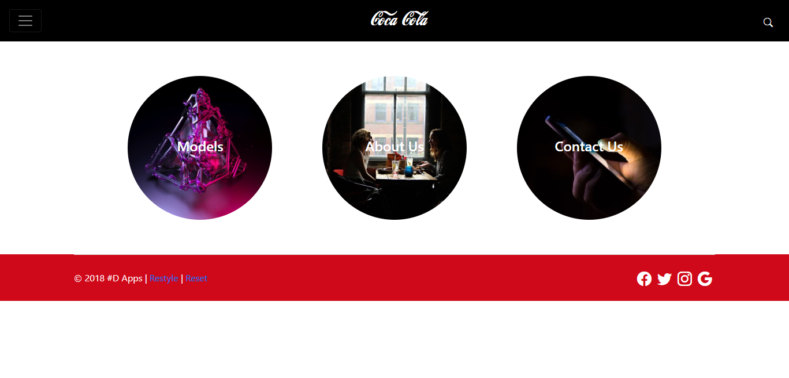
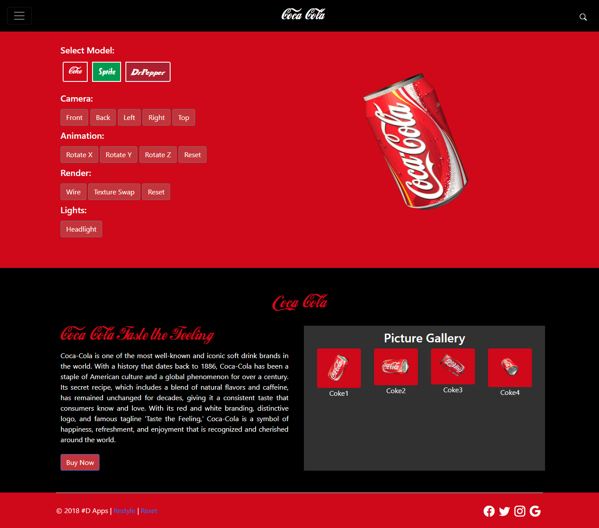
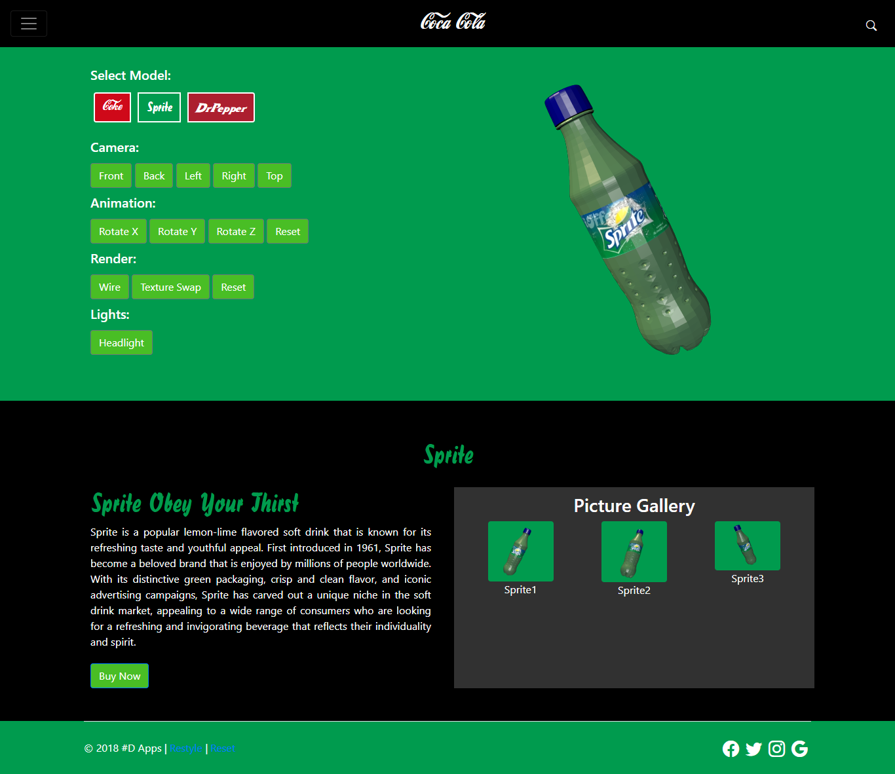

# X3D-CocaCola
This is a website which uses X3D library to display the 3D models of the products of coca cola company. The products includes Coke, Sprite and Dr Pepper. There are also different operations that you can do on the model such as showing wireframes, rotation etc. Enjoy! 🙂

``` Just place the source php files in the Apache server and the program should workd fine. All libraries are also included ```

**Visit Demo Site:** <a href="http://coke-3d.42web.io/?i=1">Click Here</a>
**X3D Website:** https://www.web3d.org/x3d/what-x3d

**Main Features**:
1. Models Changing
2. Animations
3. Camera Angles
4. Lights Changing
5. Swap Textures
6. Render Wireframes
7. Free Model Adjusting using mouse

## Screenshots

#### Home Page


#### Coke Model


### Sprite Model
